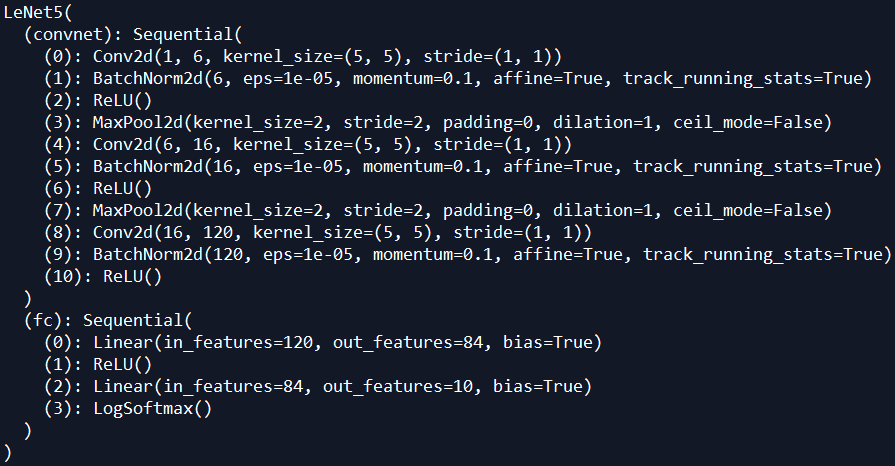

# LeNet5-for-MNIST-with-PyTorch

## Requirement

+ PyTorch 1.0

## Model architecture

## Result

The model achieves 99.13% accuracy on the test dataset without any parameters tuning.

## Reference

1. [pytorch-tutorial by yunjey](https://github.com/yunjey/pytorch-tutorial/blob/master/tutorials/02-intermediate/convolutional_neural_network/main.py)

2. [https://github.com/activatedgeek/LeNet-5](https://github.com/activatedgeek/LeNet-5)

3. [深度学习与PyTorch入门实战教程 by 龙龙老师](https://study.163.com/course/courseMain.htm?share=1&shareId=1028735623&courseId=1208894818&_trace_c_p_k2_=89730078c2624150ae9b2a3a93b8d520)